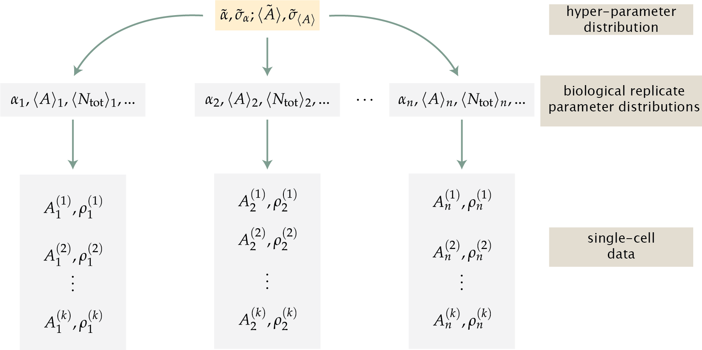

#

## STANDARD CANDLE CALIBRATION ##

------ 
WE would like to have some way to convert measured intensity to total channel copy number. To get this calibration factor, we could perform single-molecule photobleaching experiments or the dilution experiment. Another way is by generating a simply statistical model based on the fruits of the labors of other.

In 2012, HJ and Maja measured the total number of MscL channels in a particular strain under a variety of growth conditions using a calibration factor determined via single-molecule photobleaching. They determined the average number of channels per cell and repeated several times to find a mean of the means and a standard error. We posit that if we growth the cells in the same way and harvest the cells at the appropriate OD, we could measure the expression using our experimental system. We would therefore have a measure of the average fluorescence of a population and the average count. It's simple algebra to get to a calibration factor from that point.

Rather than just making one measurement and performing the division, we would want to do this several times to have an accurate measure of the expression. Each one of these experiments would be conducted in a slightly different manner (e.g. harvested at slightly different OD's, slightly different treatment, etc). Each replicate, therefore, would have its own unique values for the average expression and the calibration factor. These features make this calculation primed for a hierarchical statistical analysis. This will allow us to properly propagate the multiple levels of error to the final calculation.

For this approach to work, we must make the assumption that thee total measured fluorescence (after background fluorescence and flattening) comes entirely from the fluorescently labeled MscL channels,
$$
I_\text{tot} = \alpha N_\text{tot},
$${#eq:ian}
where $I_\text{tot}$ is the total measured intensity, $\alpha$ is the calibration factor, and $N_\text{tot}$ is the total number of channels in a single cell.  OUr knowledge of the channel copy number is known only for the average cell in the population. We can therefore rewrite [@eq:ian] in terms of averages as 
$$
\langle I_\text{tot} \rangle = \alpha \langle N_\text{tot}\rangle
$${#eq:avg_ian}.

All of these measurements are made via microscopy. As is the nature of the experiments, cells that are about to divide or small clusters of cells could be counted a single cell with a very large number of channels. We can correct for this effect by calculating the average areal intensity and multiplying by the average cellular area, which we can restrict to reasonable bounds in the analysis (e.g. no cells larger than 10 $\mu$m$^2$ in projected 2D area). Using ths correction, [@eq:avg_ian] can be written  as
$$
\langle I_\text{tot} \rangle = \langle I_{\mu m^2} \rangle \langle A \rangle = \alpha \langle N_\text{tot} \rangle,
$${#eq:ian_area}

where $\langle A \rangle$ is the average cell area of the population. Rewriting [@eq:ian_area]  to solve for $\alpha$ yields
$$
\alpha = {\langle I_{\mu m^2} \rangle \langle A \rangle \over \langle N_\text{tot} \rangle}.
$${#eq:alpha_definition_avgs}

With this model in hand, we can construct a Bayesian hierarchical model to estimate the most likely value of $\alpha$ from a set of several biological replicates. 

### A hierarchical model for $\alpha$. ###

#### A single replicate
We can begin by thinking of a single biological replicate. Suppose this data set contains many measurements of single cells and includes the average areal intensity of each cell and the cell area (both in the same units of area, such as pixels or $\mu$m$^2$). Using Bayes' theorem, and our knowledge of the mean expression level (from HJ and Maja), we can write an expression for the probability distribution of $\alpha$  as

$$
g(\alpha, \langle I_{A} \rangle, \langle A\rangle \,\vert\, D \langle N_\text{tot} \rangle) = {f(D\,\vert\, \alpha, \langle I_A \rangle, \langle A \rangle, \langle N_\text{tot}\rangle)g(\alpha, \langle I_A \rangle, \langle A \rangle)f(\langle N_\text{tot}\rangle)\over f(\langle I_A \rangle , \langle A \rangle, \langle N_\text{tot} \rangle )}.
$$ {#eq:bayes}

As the average area is independent of the average intensity, the likelihood can be rewritten as
$$
f(\langle I_A \rangle, \langle A \rangle) = f(\langle I_A \rangle\, \vert \, \langle N_\text{tot} \rangle, \alpha, \langle A \rangle) f(\langle A \rangle)f(\langle N_\text{tot} \rangle).
$${#eq:area_likelihood}
However, we must be careful to include the single cell area in our definition of the likelihood for $I_A$, which we will get to shortly.

For these likelihoods, we can make some assumptions about their distributions. As the cell area and the intensity are both the result of many independent cellular processes, we can assume that they are normally distributed. We can therefore write the likelihood for the area,
$$
f(\langle A \rangle\, \vert \sigma_A, D) = {1 \over (2\sigma_A^2\pi)^{k/2}}\prod\limits_{j=1}^k\exp\left[-{(A_j - \langle A \rangle)^2 \over 2\sigma_A^2 }\right],
$${#eq:area_like}

where $D$ represents the set of $k$ experimental measurements. Similarly, we can use [@eq:ian_area] to write the likelihood for the average areal intensity as
$$
f(\langle I_A \rangle\, \vert \, \sigma_{I_A}, \alpha, \langle N_\text{tot} \rangle, \langle A \rangle ,D) = {1 \over (2\sigma_{I_A}^2\pi)^{k/2}}\prod\limits_{j=1}^k\exp\left[- {\left({I_j \over A_j} - {\alpha \langle N_\text{tot}\rangle \over \langle A \rangle }\right)^2  \over 2\sigma_{I_A}^2}\right],
$${#eq:intensity_like}

where we have used [@eq:ian_area] to calculate $\langle I_A \rangle$ of the population.

In our assumption of normal distributions for the areal intensity and area, we have included two new parameters which capture the error in our measurement $\sigma_A$ and $\sigma_{I_A}$. The complete posterior distribution for  a single biological replicate is therefore

$$
\begin{aligned}
g(\alpha, \langle A \rangle, \langle N_\text{tot}\rangle, \sigma_A, \sigma_{I_A} \vert  D) =& {1 \over (2\pi \sigma_A \sigma_{I_A})^k}\prod\limits_{j=1}^k\exp\left[-{(A_j - \langle A \rangle)^2 \over 2\sigma_A^2} - {\left({I_j \over A_j}- {\alpha \langle N_\text{tot} \rangle \over \langle A \rangle}\right)^2 \over 2 \sigma_{I_A}^2 } \right]\,\times\, \\
&f(\langle N_\text{tot}\rangle)g(\alpha,\sigma_A, \sigma_{I_A}),
\end{aligned}
$$
{#eq:single_rep_posterior}

With the likelihood completely described, we are left with fiulling in the priors. The most obvious prior to define is for $\langle N_\text{tot}\rangle$. From the literature, we know the mean value $\mu_{N}$  and a variance $\sigma_{N}$ for this particular strain and growth condition. Using these values, we can specify the prior as

$$
g(\langle N_\text{tot} \rangle\, \vert\, \mu_N, \sigma_N) = {1 \over \sqrt{2\pi\sigma_N^2}} \exp\left[-{\left(\langle N_\text{tot}\rangle - \mu_N\right)^2}\over 2\sigma_N^2\right].
$$

We can, of course, specify priors for inferred parameters to be maximally uninformative. However, as we have multiple replicates and we are assuming each replicate is comparable to another, we can be a bit more informative with these priors.

#### Multiple replicates

We expect each biological replicate to behave the same, despite the small experimental differences between them. This means that the model shown in [@eq:single_rep_posterior] should be the same for each replicate. However, we know that the parameters $\alpha, \sigma_A,$ and $\sigma_{I_A}$ should be very similar between replicates. In fact, we can say that the values for each individual replicate are drawn from the same distribution.

The functional form of this distribution is not obvious. However, we know that the value is the result of many independent processes, meaning it is likely gaussian. 

With this assumption in place, we can write the prior distribution of $\langle A \rangle$ for a set of $n$ replicates as

$$
g(\langle A \rangle\, \vert \, \tilde{\langle A \rangle}, \tilde{\sigma_A}) = {1 \over (2\pi\tilde{\sigma_A}^2)^{n/2}} \prod\limits_{i=1}^n \exp\left[-{\left(\langle A_i\rangle - \tilde{\langle A \rangle}\right)^2 \over 2 \tilde{\sigma_A}^2}\right],
$${#eq:area_prior}

and for $\alpha$,

$$
g(\alpha\, \vert \tilde{\alpha}, \tilde{\sigma_\alpha}) = {1 \over (2\pi\tilde{\sigma_\alpha}^2)^{n/2}} \prod \limits_{i=1}^{n}\exp\left[-{\left(\alpha_i - \tilde{\alpha}\right)^2 \over 2\tilde{\sigma_\alpha}^2}\right].
$${#eq:alpha_prior}.

While we have taken care of the priors listed in [@eq:single_rep_posterior], we have introduced four new parameters, which each need their own prior! For these,we can be maximally uninformative. For $\tilde{\langle A \rangle}$, we can impose a uniform prior over a reasonable range for the size of *E. coli*,

$$
g(\tilde{\langle A \rangle}) = \begin{cases}\left(\tilde{\langle A \rangle}_\text{max} - \tilde{\langle A \rangle}_\text{min}\right)^{-1} & \tilde{\langle A \rangle}_\text{min} \leq \tilde{\langle A \rangle} \leq \tilde{\langle A \rangle}_\text{max}\\
0 & \text{otherwise}
\end{cases}.
$${#eq:area_hyperprior}

We know that the value of $\alpha$ is limited by the bit depth of our camera, though not necessarily an integer. We can assign a uniform prior for $\alpha$ as

$$
g(\tilde{\alpha}) = \begin{cases} \left(\tilde{\alpha}_\text{max} - \tilde{\alpha}_\text{min}\right)^{-1} & \tilde{\alpha}_\text{min} \leq \tilde{\alpha} \leq \tilde{\alpha}_\text{max}\\
0 & \text{otherwise}
\end{cases}.
$${#eq:alpha_hyperprior}

For $\tilde{\sigma_\alpha}$ and $\tilde{\sigma_A}$, we can use a maximally uninformative Jeffreys priors, 

$$
g(\tilde{\sigma_\alpha}) = {1 \over \tilde{\sigma_\alpha}},
$${#eq:sigma_alpha_hyperprior}

and 

$$
g(\tilde{\sigma_A}) = {1 \over \tilde{\sigma_A}}.
$${#eq:sigma_area_hyperprior}

Using [@eq:bayes] through [@eq:sigma_area_hyperprior], we can formulate the complete posterior probability distribution,
$$
\begin{aligned}
&g(\alpha, \tilde{\alpha}, \langle A \rangle, \tilde{\langle A \rangle}, \langle N_\text{tot} \rangle, \tilde{\sigma_\alpha}, \sigma_A, \tilde{\sigma_A}, \sigma_{I_A}\,\vert \, \sigma_N, \mu_N, D) = \\
& {1 \over \tilde{\langle A \rangle}_\text{max} - \tilde{\langle A \rangle}_\text{min}}{1 \over \tilde{\alpha}_\text{max} - \tilde{\alpha}_\text{min}}{1 \over \left(\tilde{\sigma_\alpha}\tilde{\sigma_A}\right)^{n+2}}\prod\limits_{i=1}^n{1 \over \left(\sigma_{A_i}^2\sigma_{{I_A}_i}^2\sigma_N^2\right)^{k_i / 2}}\times\\
&\prod\limits_{j=1}^{k_i}\exp\left[-{\left(A_{i,j}-\langle A \rangle_i\right)^2 \over 2\sigma_{A_i}^2} - {\left({I_{A_{i,j}} - {\alpha_i \langle N_\text{tot}\rangle_{i} \over \langle A\rangle_i}}\right)^2 \over 2\sigma_{{I_A}_i}^2}-{\left(\alpha_i - \tilde{\alpha}\right)^2 \over 2\tilde{\sigma_{\alpha}}^2}-{\left(\langle A \rangle_i - \tilde{\langle A \rangle}\right)^2 \over 2\tilde{\sigma_A}^2}-{\left(\langle N_\text{tot}\rangle_i - \mu_N\right)^2 \over 2\sigma_N^2}\right],
\end{aligned}
$${#eq:posterior}

where the normalization constants have been dropped for notational clarity.

